  

  <b>@theyashsawarkar</b> everywhere
    
  🌐 <a href="https://yash-sawarkar-portfolio.vercel.app">Portfolio</a>
  &nbsp;·&nbsp;
  💼 <a href="https://www.linkedin.com/in/theyashsawarkar/">LinkedIn</a>
  &nbsp;·&nbsp;
  🐦 <a href="https://x.com/theyashsawarkar">X</a>
  &nbsp;·&nbsp;
  📸 <a href="https://www.instagram.com/theyashsawarkar/">Instagram</a>
  &nbsp;·&nbsp;
  🥷 <a href="https://www.naukri.com/code360/profile/Theyashsawarkar">Code360</a>
  &nbsp;·&nbsp;
  ✉️ <a href="mailto:yashsawarkar01@gmail.com">Email</a>

 

### 👋 Hi, I'm Yash

A full-stack developer at **Nimap Infotech**, from Maharashtra 🇮🇳. I build web apps on the **MERN stack** ⚛️, and I like owning what happens after the code too: Docker images 🐳, CI pipelines, servers and deploys.

Next, I'm heading into **generative AI** 🤖. I'm learning how LLM apps and agents really work by building with them: an OpenAI-powered feature here, a remote runner for Claude Code over MCP there.

### 🧭 The path so far

- 🌱 **2023** &nbsp; HTML, CSS, JavaScript → React
- ⚛️ **2024** &nbsp; MERN apps: VideoTube, DSA Simplified, True Feedback
- 🧩 **2025** &nbsp; An internship, low-level design in Java, DSA in C++
- 🐳 **2026** &nbsp; Docker, Jenkins pipelines, Nginx, AWS & GCP, monorepos, Linux
- 🤖 **Next** &nbsp; GenAI: LLM apps, agents, MCP

### 🚀 Selected work

| Project | |
|:--|:--|
| 🛣️&nbsp;**[Highwayman](https://github.com/Theyashsawarkar/highwayman)** | Run Claude Code from anywhere: a web UI that streams a session live, and a runner CLI that executes Claude's tools on another machine over MCP Node.js · Express · WebSockets · MCP |
| 💬&nbsp;**[True&nbsp;Feedback](https://github.com/Theyashsawarkar/True-Feedback)** [live ↗](https://true-anonymous-feedback.vercel.app) | Anonymous feedback through a shareable link, with OpenAI-suggested messages Next.js · TypeScript · MongoDB · NextAuth · OpenAI |
| 🎬&nbsp;**[VideoTube](https://github.com/Theyashsawarkar/VideoTube-FrontEnd)** [live ↗](https://videotube-frontend.vercel.app) · [backend](https://github.com/Theyashsawarkar/VideoTube-BackEnd) | YouTube meets Twitter: video hosting with tweets, likes and subscriptions React · Redux · Node.js · Express · MongoDB · JWT |
| ⚙️&nbsp;**[Backend&nbsp;Starter](https://github.com/Theyashsawarkar/Backend-Starter)** | A Dockerised Node backend with a Jenkins pipeline: per-environment builds, images shipped to the server Docker · Jenkins · Node.js |
| 🧠&nbsp;**[DSA&nbsp;Simplified](https://github.com/Theyashsawarkar/Dsa-Simplified)** [live ↗](https://dsasimplified.vercel.app/) | Data structures and algorithms, explained in plain language React · Redux · Appwrite · Tailwind |
| 🌬️&nbsp;**[Vayu](https://github.com/Theyashsawarkar/vayu)** [site ↗](https://theyashsawarkar.github.io/vayu/) | My keyboard-driven Arch Linux desktop, reproducible with one command, with tools for AI agents Shell · Python · Linux |

### 🧰 Toolbox

| | |
|:--|:--|
| 🏗️ **Build** |  |
| 🚢 **Ship** |  |
| ➕ **Also** |  |
| 🔭 **Exploring** | OpenAI API · Claude Code · MCP · AI agents |

 

⚡ Always building something. Say hi on any of the links above. ⚡

